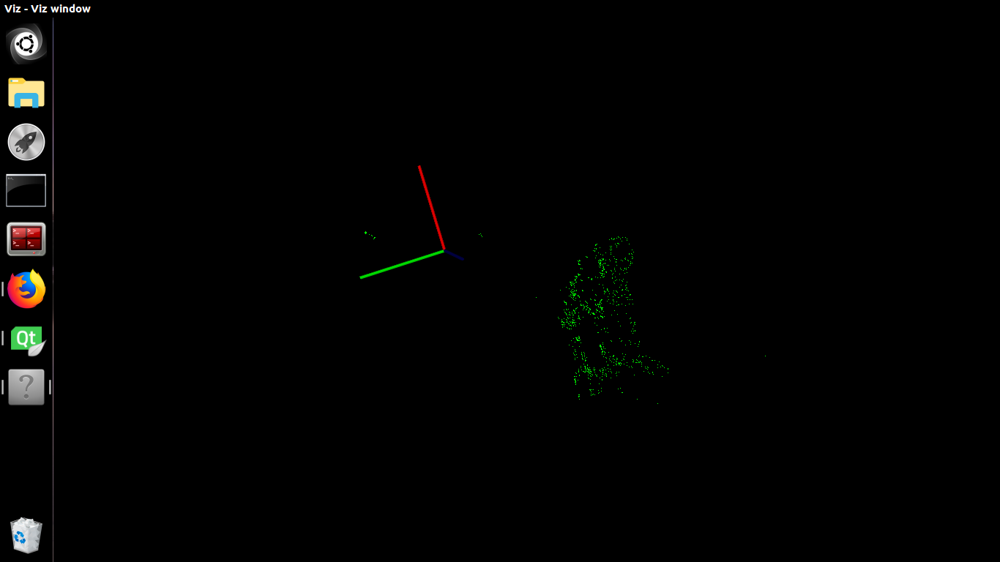

# A simple structure from motion pipeline for 3D incremental reconstruction

This is a reference implementation of a Structure-from-Motion pipeline in OpenCV, following the work of Roy Shilkrot at SfM-Toy-Library. https://github.com/royshil/SfM-Toy-Library

*Note:* This is not a complete and robust SfM pipeline implementation. The purpose of this code is to do a 3D reconstruction of a tree and get dendrometry estimation. 

----------------------

A simple incremental SFM pipeline for 3D reconstruction of a tree with bundle adjustment. 
* Incremental SFM
* Bundle Adjustment - Ceres solver
* Densification process - PMVS2 

## Example

 

### Resources

* Homepage: <http://opencv.org>
* Docs: <http://docs.opencv.org/master/>

## Build 

To build use CMake minimum required 3.5.1 : https://github.com/Kitware/CMake

### Prerequisite
- OpenCV 3.4.1: https://github.com/opencv/opencv/tree/3.4.1
- PCL 1.8.1: https://github.com/PointCloudLibrary/pcl/tree/pcl-1.8.1

### Compilation
* Set "YOUR OWN" PCL Build DIR in CMakeList.txt e.g: **/opt/pcl-1.8.1/build** and save it.
* Set "YOUR OWN" OpenCV Build DIR in CMakeList.txt e.g: **/opt/opencv-3.4.1/build** and save it.
* Create a "build" folder

in the main folder:

    cd /build  
    cmake ../
    make
 	 
### Test
	cd /build/bin
	./iTree3DMap

*Note:*
If OpenCV is not installed (just compiled). please set the path to the current build directory in the CMakeList.txt file.

